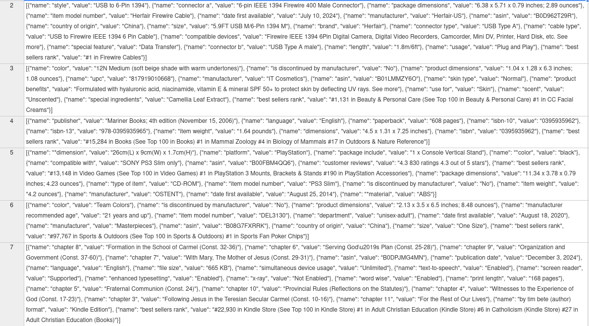
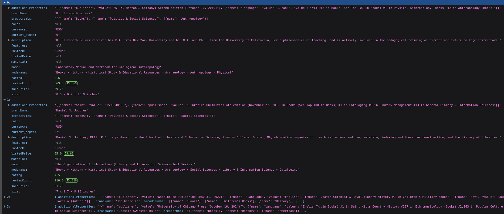
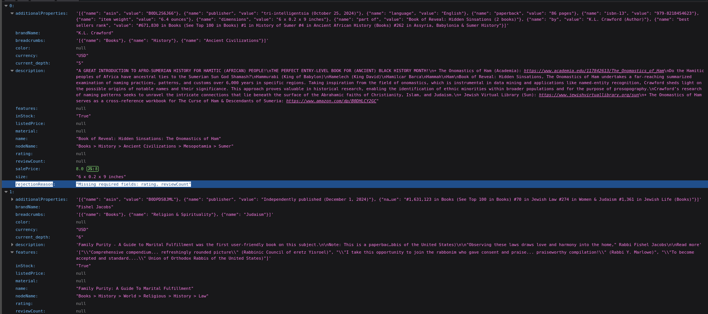
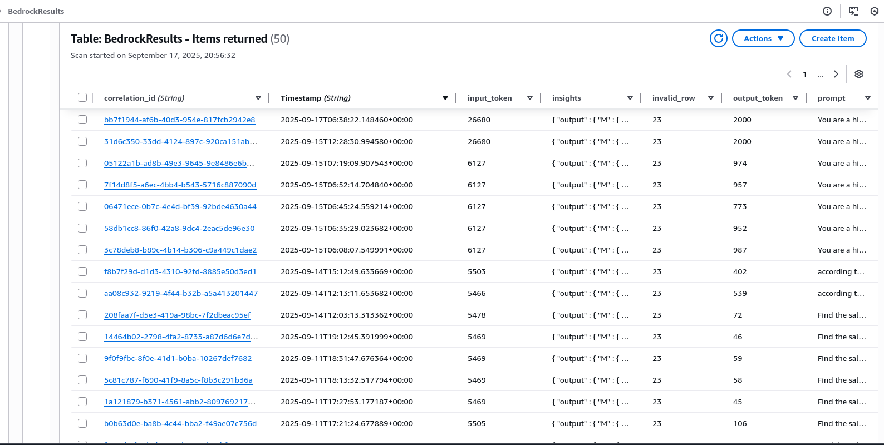
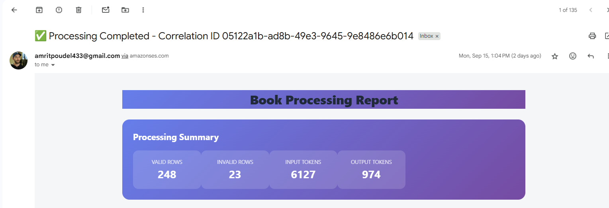
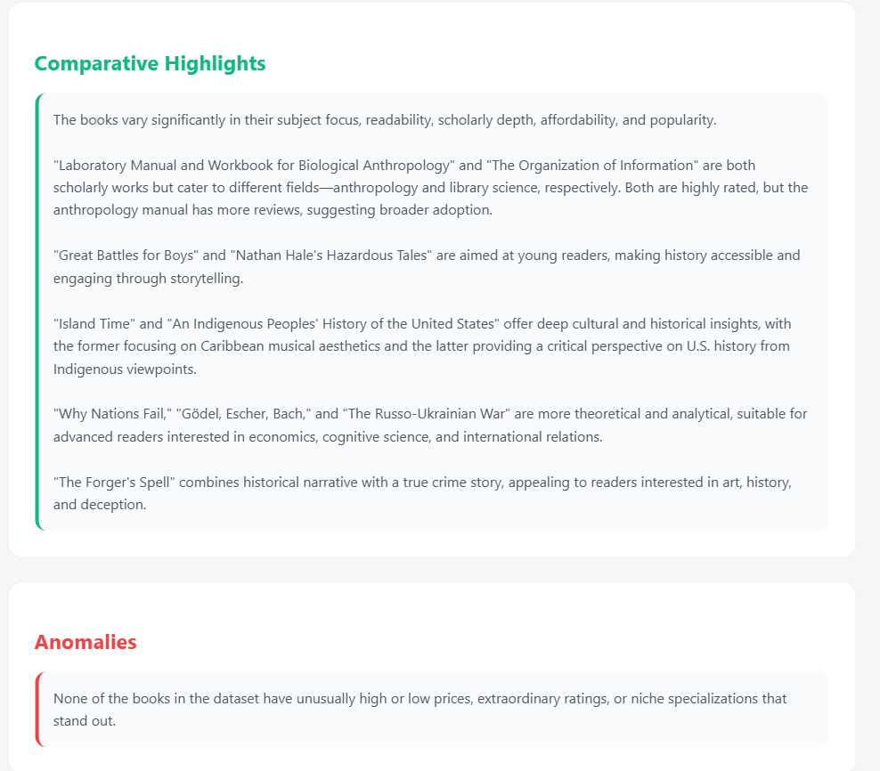
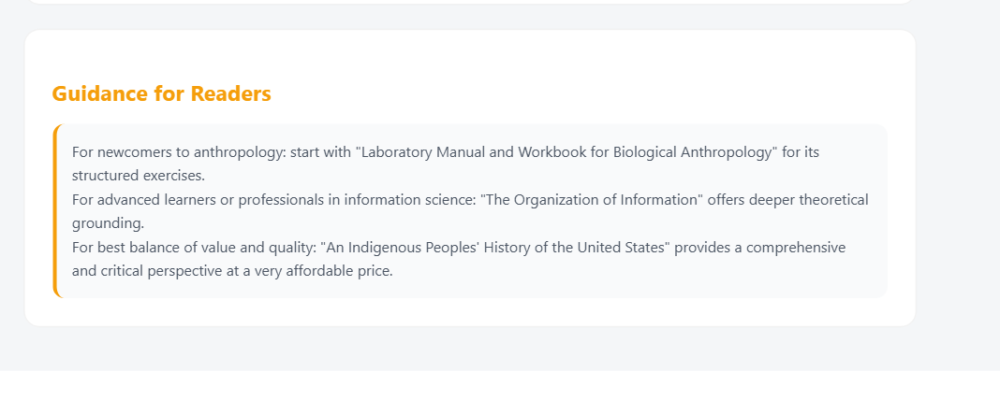
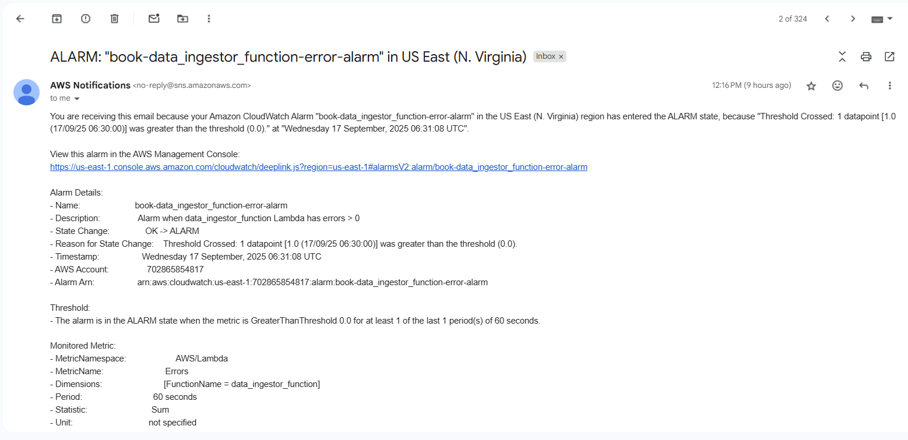

## Documentation of Serverless Assignment

## 1. Step-by-step setup guide (Terraform init/apply, AWS CLI prerequisites).

###  Setting up AWS

Downloading the aws cli and setting up the  AWS credentials.

**AWS CLI**

```
curl "https://awscli.amazonaws.com/awscli-exe-linux-x86_64.zip" -o "awscliv2.zip"
unzip awscliv2.zip
sudo ./aws/install
```

**AWS Credentials Setup**

Setup the credentials after the `aws configure` command.


### Setting up Terraform

Download the Terraform.
```
 wget https://releases.hashicorp.com/terraform/1.13.2/terraform_1.13.2_linux_amd64.zip
```

Unzip and setting up binary file location.

```
unzip terraform_1.13.2_linux_amd64.zip -d /usr/local/bin/
```


### GitHub repository Clone.
```
git clone https://github.com/PoudelAmrit123/serverless
```

```
 cd serverless
```

Now for Implementing the Project.


**Push commit to the `main` branch.**

---
 


Initilize the terraform Project.

```
terraform init
```

Plan and Apply the Configuration Directly.
```
terraform plan 
```
```
terraform apply 
```


The File should be Uploaded to the S3 bucket.
```
aws s3 cp amazon_data.csv s3://amrit-s3-bucket-lf/input/<data>
```

The Test Have the Sample Data in the Test Function itself so one can change it.
The  test is done using the pytest.

## 2. High Level Overview 


.png)


## 3. Flow 

The user upload the data to the s3 bucket and uploading it to the /input invoke the data ingestor lambda function and the lambda function validate the data and seperate out to two different selected and rejects data. After that event bridge then invoke the data analyzer lambda function and it call the bedrock and then  store the value to the dynamoDB. After the completion of pushing data to the dynamoDB event bridge invoke the notifer function which get the value from the dynamoDB and then send the email using SES.


The user upload the data to the s3 bucket and uploading it to the /input invoke the data ingestor lambda function and the lambda function validate the data and seperate out to two different selected and rejects data. After that event bridge then invoke the data analyzer lambda function and it call the bedrock and then  store the value to the dynamoDB. After the completion of pushing data to the dynamoDB event bridge invoke the notifer function which get the value from the dynamoDB and then send the email using SES.


The user upload the data to the s3 bucket and uploading it to the /input invoke the data ingestor lambda function and the lambda function validate the data and seperate out to two different selected and rejects data. After that event bridge then invoke the data analyzer lambda function and it call the bedrock and then  store the value to the dynamoDB. After the completion of pushing data to the dynamoDB event bridge invoke the notifer function which get the value from the dynamoDB and then send the email using SES.


## 4. Lambda Function

The serverless Project Have three Different lambda Function `data_ingestor_function` , `data_analyzer_function` and `notifier_function`.

### 4.1 Data Ingestor function

#### 4.1.1 Main Role of The Lambda Function 
The  Lambda function  process a CSV file uploaded to S3 bucket in `/input` key, clean and validate the dataset, and then separate valid vs. invalid data into `/processed` and `/rejects` S3.

#### 4.1.2 Different functions
  - Create the correlation id and then compare the correlation id with processed/selected_data.json and if find same skip the process.

  - Read the CSV dataset uploaded to the s3 bucket with the key /input and filter the category with the provided nodeName( column name). 

  - Validate the Data and store the data in the bucket with the key /processed for valid data and /rejects for invalid data.

  - For Rejected Data the new field `rejectionReason` is added with the potential resion for invalidation of the data.

  - metadata is appended to the valid data with the information about correlationID , source-etag , valid and invalid rows count for the another analyzer lambda function.

  - Use of logging module for the proper logging.


### 4.2 Data Analyzer Function.

#### 4.2.1 Main Role of The Lambda Function.

The lambda function take the processed data from the data ingestor lambda and then it call the bedrock api with the model  `amazon.nova-micro-v1:0` and then stored the information in DynamoDB and triggers the event bridge. 


#### 4.2.2 Different functions.

  - Fetch the json file from the s3 and also reads the metadata by the ingestor function.

  - Narrows dataset to first 15rows (can be increased) and it uses the bedrock to analyze the dataset with the prompt.

  - The bedrock response is then parsed to extract the summary and usage details( token count) and is stored in the dynamoDB.

  - Send the new event to event bridge to trigger the notifier lambda and also use the logging module for proper logging.


### 4.3 Notifer Function.

#### 4.3.1 Main Role of The Lambda Function. 

The lambda function take the value from the dynamoDB and create the custom messgae and use the SES service to send the email by analyzing the output and segratting it as summary , anomolies , recommendations.


#### 4.3.2 Different functions.

 - Fetch the Correlation Id and timestamp from the event and also fetch the record from the dynamoDB using the same correlationID and timestamp. 

 - Extract the different values like input token , output token , valid and invalid rows.

 - Detect the anomalies using the phrases like 'no answer' , 'i'm sorry, ..' , 'can't provide specific .. ' words.

 - Extract the different section from the response like overview , highlight , guidance.

 - Create the Responsive HTML Body summarzing all the information.

 - Use the SES to send the mail to the destination email address.

### 4.4 Retries in Lambda Function.
 
  The retries involve in the bedrock request when there is the error in the bedrock response then the function retires for three more times.
  Code Snippt:

  ```
    max_retries = 3
    delay = 2  
    attempt = 0
    bedrock_response = None

    while attempt < max_retries:
        try:
            bedrock_response = bedrock.invoke_model(
                modelId="amazon.nova-lite-v1:0",
                contentType="application/json",
                accept="application/json",
                body=json.dumps({
                    "messages": [
                        {"role": "user", "content": [{"text": prompt_with_data}]}
                    ]
                })
            )
         
            break
        except Exception as e:
            attempt += 1
            log_json(logging.WARNING, f"Bedrock invocation failed, attempt {attempt}", correlation_id, error=str(e))
            if attempt >= max_retries:
                log_json(logging.ERROR, "Max retries reached for Bedrock invocation", correlation_id, error=str(e))
                raise
            else:
                time.sleep(delay)
                delay *= 2 
  ```


 ## 5. Event Bridge.

 Amazon Event Bridge is a serverless event bus service that provide its service based on event-driven architecture. 
 In the Project the Event bridge is used to trigger the lambda function and also to pass the information to another lambda function.

 The Project use two different event bridge rule.

 ### 5.1 First Event Bridge (s3_processed_data_rule)

 This Event bridge have the rule set that whenever the object is created in the particular bucket with the fixed key then the target lambda function is triggered.

 Code Snippt:
 ```
       resource "aws_cloudwatch_event_rule" "s3_processed_rule" {
        name        = "s3_processed_data_rule"
        description = "trigger Bedrock Lambda when processed data is uploaded"
        event_pattern = jsonencode({
            "source": ["aws.s3"],
            "detail-type": ["Object Created"],
            "detail": {
            "bucket": {
                "name": ["amrit-s3-bucket-lf"]
            },
            "object": {
                "key": [{"prefix": "processed/selected_data.json"}]
            }
            }
        })
        }
```

The Event Bridge then have the target set up to the lambda function that will then invoke that function.


### 5.2 Second Event Bridge (notifier_rule)

This Event bridge have the rule set up to invoke the notifer lambda function when completed.
The rule then look for the source and detail-type and try to match in the event send.


Code Snippt:
```

        resource "aws_cloudwatch_event_rule" "notifier_rule" {
        name        = "bedrock_completed_rule"
        description = "trigger Notifier Lambda when Bedrock Lambda completes"
        event_pattern = jsonencode({
            "source": ["my.data.analyzer"],
            "detail-type": ["DataAnalysisCompleted"]
        })
        }
```
The Eventbridge Events.

```
eventbridge.put_events(
    Entries=[{
        "Source": "my.data.analyzer",
        "DetailType": "DataAnalysisCompleted",
        "Detail": json.dumps({
            "correlation_id": correlation_id,
            "s3_bucket": bucket_name,
            "s3_key": output_key,
            "timestamp": timestamp
        }),
        "EventBusName": "default"
    }]
)
```

The Advantage of Event Bridge in this Project.

 
    -  The analyzer function do not need to know about the notifer lamda exists. 

    - There is the guaranteed payload delivery (correlationID , timestamp) which is very importance for the notifer function to retirve the value from the dynamoDB table.

    - There is the need to track the correlationID and pass that to different lambda function for tracking in whole process so event bridge help in that to pass that correlationId and timestamp which will be difficult if we donot use the event bridge.(DynamoDB stream can be used but that will only be created when we write on table. So if we want to send like the dynamoDb table write failed through the notifier lambda this will create problem).

   - And there can be many lambda function that can listen to the same event which is also the main role of the eventbridge.


## 6. Security Measures 

 The Project try to follow the least privilege principle and the encryption. 
 
Example:
 The Codebuild IAM Policy implement  the least privilege to only give the permisison for action that is only need.
 Code Snippt for the S3 bucekt and object level permission given to the codebuild iam policy.


```
  
      {
        Effect = "Allow",
        Action = [
          "s3:GetObject",
          "s3:PutObject",
          "s3:DeleteObject"
        ],
        Resource = [
          "${var.backend_bucket_arn}/*",
          "${var.s3_main_bucket_arn}/*",
          "${aws_s3_bucket.codepipeline_s3_bucket.arn}/*"
        ]
      },
     
      {
        Effect = "Allow",
        Action = [
          "s3:GetBucketPolicy",
          "s3:GetBucketAcl",
          "s3:GetBucketVersioning",
          "s3:GetBucketCors",
          "s3:ListBucket",
          "s3:GetBucketWebsite",
          "s3:GetAccelerateConfiguration",
          "s3:GetBucketRequestPayment",
          "s3:GetBucketReplication",
          "s3:GetBucketTagging",    
          "s3:GetBucketLogging",
          "s3:GetEncryptionConfiguration",
          "s3:GetLifecycleConfiguration",
          "s3:GetEncryptionConfiguration",
          "s3:GetReplicationConfiguration" ,
          "s3:GetBucketObjectLockConfiguration" ,
           "codepipeline:GetPipeline",
           "s3:GetBucketNotification",
            "codepipeline:GetPipelineState",
            "codepipeline:ListPipelines",
            "s3:GetBucketOwnershipControls" ,
            "s3:GetObjectVersion",
            "codepipeline:ListTagsForResource"
        ],
        Resource = [
          var.backend_bucket_arn,
          var.s3_main_bucket_arn,
          aws_s3_bucket.codepipeline_s3_bucket.arn,
          aws_codepipeline.codepipeline_project.arn
        ]
      },

```

The S3 Bucket is server-side encryption with aws managed encryption.
Code Snippt:
```

resource "aws_s3_bucket_server_side_encryption_configuration" "s3_encryption" {
    bucket = aws_s3_bucket.s3_bucket.id
    rule {
      apply_server_side_encryption_by_default {
        sse_algorithm = "AES256"
      }
    }

  
}
```

The Bucket are also Versioned enabled.
Code Snippt:
```
resource "aws_s3_bucket_versioning" "aws_s3_bucket_versioning" {
    bucket = aws_s3_bucket.s3_bucket.id
    versioning_configuration {
      status = "Enabled"
    }
  
}

```

And also  Different  lambda Function have different lambda Role with their respective needed permission.


## 7. Bedrock COST Analysis

Model Used: `amazon.nova-lite-v1:0`

Bedrock Cost: 

- Input tokens: $0.00006 per 1,000 tokens
- Output tokens: $0.00024 per 1,000 tokens
- Context window: 300K tokens

<!-- **Input Token**


The Prompt Count: ~ 650 Token  ( with out data).

The User Data Per Row: ~ 235 Token.

For 50 records :  235 * 50 = 11750 Token (  Can be Varied )

Total Input Token:  12400 Token.

The Input Token used in Latest Upload: 26680 ( from the response of BedRock)

**Output Token**

Total Output Token: 2000 Token

**Total Cost Estimation**

Input Token Cost: $0.00006 * 26680 / 1000 = $ 0.0016008 per request.
Output Token Cost: $0.00024 * 2000 /1000 = $ 0.00048 per request.

Total Cost: $ 0.0020808 per request.
 -->

 ## Input Token  
| Item                     | Details / Calculation        | Tokens         |
|---------------------------|------------------------------|----------------|
| Prompt Count              | Without data                | ~650           |
| User Data Per Row         |                              | ~235           |
| For 50 Records            | 235 × 50                    | 11,750 (varies)|
| Total Input Token         | Approx.                     | 12,400         |
| Input Token (Bedrock)     | From latest upload           | 26,680         |

### Output Token
| Item              | Details / Calculation          | Tokens   |
|-------------------|--------------------------------|----------|
| Output Token      |         From last bedrock reponse                       | 2,000    |

###  Cost Estimation  
| Type              | Calculation                           | Cost ($)     |
|-------------------|---------------------------------------|--------------|
| Input Token Cost  | $0.00006 × 26,680 ÷ 1,000             | 0.0016008    |
| Output Token Cost | $0.00024 × 2,000 ÷ 1,000              | 0.00048      |
| **Total Cost**    | Input + Output                        | **0.0020808**|

Total  Cost: 0.0020808 per Request.


## 8. Screenshot


***Original Data in CSV.***



The dataset is Huge and have different topics. 
The subtopics is choosen in data ingestor lambda and then The selection and rejection of the data occur after filtering out the sub topics. 

**Selection of Data**

The row is selected which donot have null in this column  ['name', 'salePrice', 'rating', 'reviewCount'].
This can be Added as per requirement.

**Selected Data**



**Rejected Data**

<!--  -->


The rejection Data also contain the Resion why it is Rejected.
`rejectionReason	"Missing required fields: rating, reviewCount"`


**DynamoDB table items.**



**SES Email with analysis**






**Cloud Watch Alarm**



Fig: CloudWatch Alarm SNS notification In Data ingestor lambda function error.


